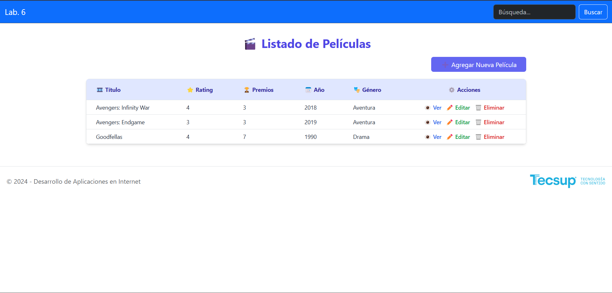
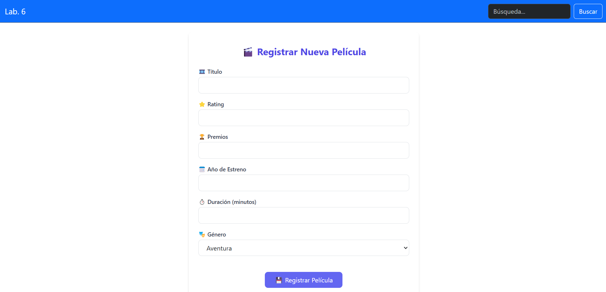
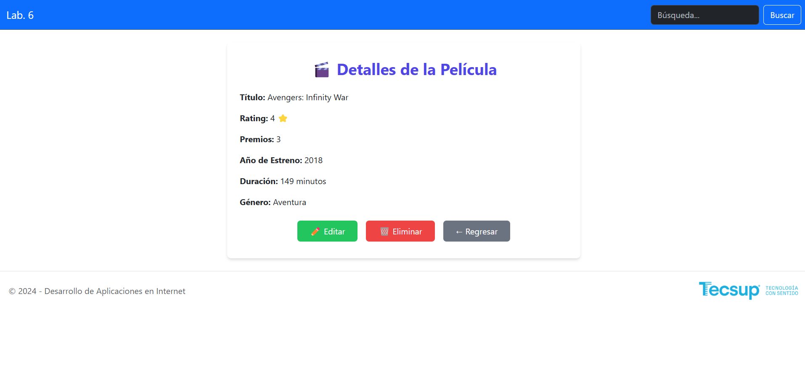

# 🧪 Laboratorio 06 – Desarrollo de Aplicaciones en Internet (DAI)

## 🧩 Proyecto

### 🏠 Principal


---

### 📝 Registro


---

### 🔍 Detalles  
📌 Aquí también se encuentran las opciones de:  
✏️ **Editar** – 🗑️ **Eliminar** – 🔙 **Regresar a la página principal**




**Curso:** Desarrollo de Aplicaciones en Internet  
**Tema:** PHP y MySQL  
**Ciclo:** III  
**Objetivo General:** Desarrollar aplicaciones con el uso de PHP y MySQL.

---

## 🛡️ II. Seguridad en el Laboratorio

- Guardar mochilas y maletines en el gabinete.
- No ingresar con alimentos ni bebidas.
- Apagar correctamente el equipo al finalizar la sesión.

---

## 🧰 III. Equipos y Herramientas

- PC con Windows
- Editor de texto (Notepad++, Sublime Text, Visual Studio Code)
- XAMPP (servidor Apache + MySQL)

---

## 📘 IV. Introducción

MySQL es un sistema de gestión de bases de datos relacional, ideal para entornos web por su rapidez en la lectura de datos. Las aplicaciones PHP pueden conectarse a MySQL usando:

### 🔗 Extensiones de conexión:

- **MySQLi**: Interfaz orientada a objetos.
- **PDO (PHP Data Objects)**: Abstracción para diferentes DBMS, interfaz ligera, orientada a objetos.

### 🔄 Flujo básico:

1. Conexión al servidor y selección de la base de datos.
2. Envío y tratamiento de consultas SQL.
3. Cierre de la conexión.

---

## 🛠️ V. Procedimiento

### 📂 1. Crear la base de datos

Ejecuta el script `movies_script.sql` desde XAMPP:

```sql
DROP DATABASE IF EXISTS movies_db;
CREATE DATABASE movies_db;
USE movies_db;
```

#### Tabla `genres`:

```sql
CREATE TABLE genres (
  genre_id INT UNSIGNED AUTO_INCREMENT PRIMARY KEY,
  created_at TIMESTAMP DEFAULT CURRENT_TIMESTAMP,
  updated_at TIMESTAMP DEFAULT CURRENT_TIMESTAMP,
  name VARCHAR(100) NOT NULL
) ENGINE=InnoDB;
```

#### Tabla `movies`:

```sql
CREATE TABLE movies (
  id INT UNSIGNED AUTO_INCREMENT PRIMARY KEY,
  title VARCHAR(500) NOT NULL,
  rating INT(4) UNSIGNED NOT NULL,
  awards INT(10) UNSIGNED DEFAULT 0,
  release_year INT(4) NOT NULL,
  length INT UNSIGNED,
  genre_id INT UNSIGNED NOT NULL,
  created_at TIMESTAMP DEFAULT CURRENT_TIMESTAMP,
  updated_at TIMESTAMP DEFAULT CURRENT_TIMESTAMP,
  FOREIGN KEY (genre_id) REFERENCES genres(genre_id)
) ENGINE=InnoDB;
```

#### Insertar datos:

```sql
INSERT INTO genres(name) VALUES 
('Drama'), ('Comedia'), ('Aventura'), ('Infantil'), ('Ciencia Ficción');

INSERT INTO movies(title, rating, awards, release_year, length, genre_id) VALUES 
('Avengers: Infinity War', 4, 3, 2018, 149, 3),
('Avengers: Endgame', 3, 3, 2019, 181, 3),
('Goodfellas', 4, 7, 1990, 146, 1);
```

---

### 📁 2. Clonar el Repositorio

```bash
git clone https://github.com/pvergel-tecsup/dai-lab06.git
```

---

## 💻 Estructura de Archivos y Código

```bash
.
├── connection/
│   └── BaseMySQL.php
├── database/
│   └── MovieDB.php
├── images/
│   └── (archivos eliminados)
├── layout/
│   └── (archivos de diseño)
├── model/
│   ├── Genre.php
│   └── Movie.php
├── index.php
├── movie_new.php
├── movie_insert.php
├── movie_show.php
├── movie_edit.php
├── movie_update.php
├── movie_delete.php
└── README.md

