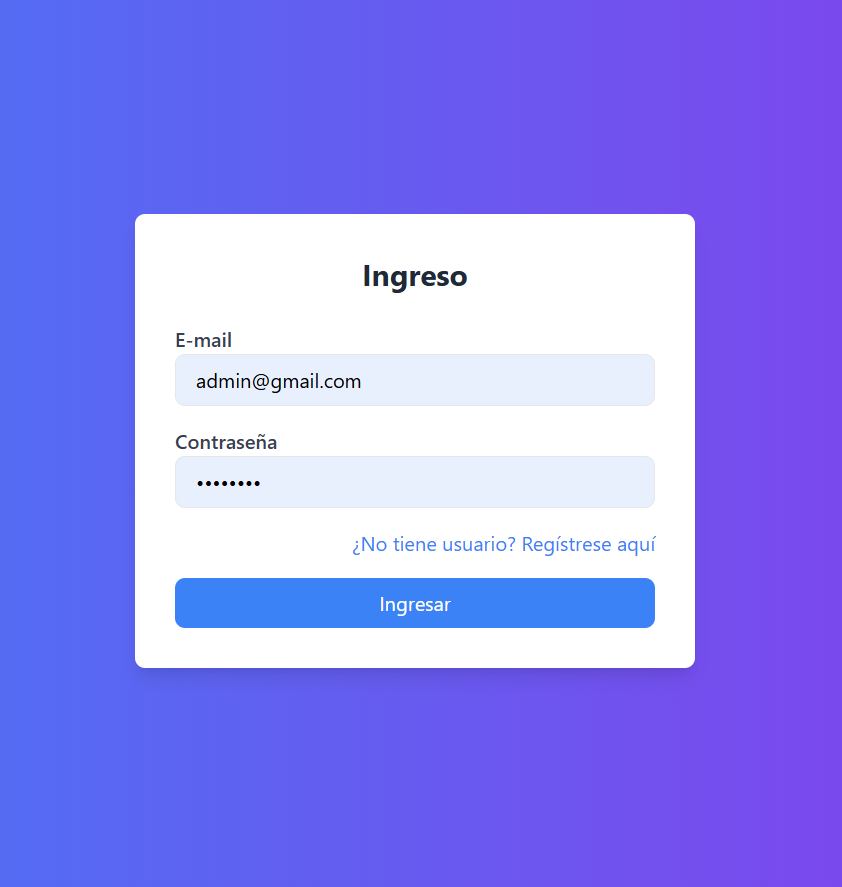
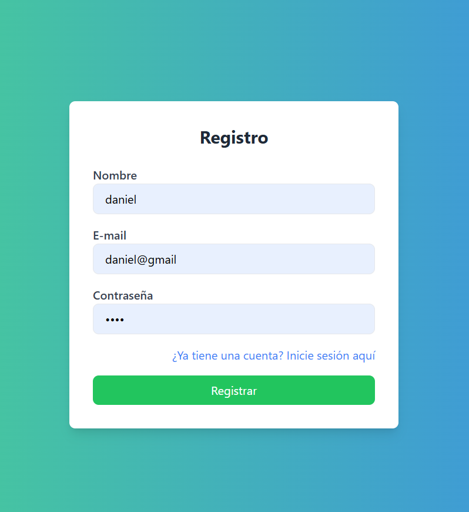
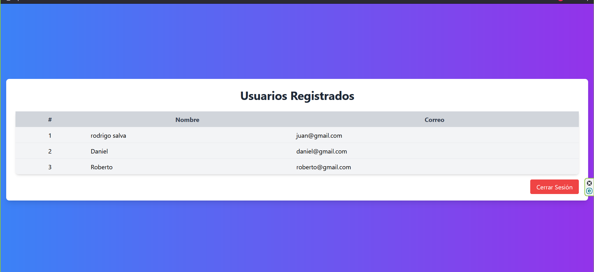

# 🧪 Laboratorio 07 – Desarrollo de Aplicaciones en Internet (DAI)

## 🧩 Proyecto

### 🧑‍💻 Login/admin


---

### 📝 Registro


---

### 🏠 Datos de las usuarios.



---

### 🚪 Cierre de Sesión
📌 Permite destruir la sesión y volver al formulario de ingreso.


---

**Curso:** Desarrollo de Aplicaciones en Internet  
**Tema:** Manejo de Sesiones en PHP  
**Ciclo:** III  
**Objetivo General:** Desarrollar aplicaciones con el uso de PHP, sesiones y manejo de datos temporales en memoria.

---

## 🛡️ II. Seguridad en el Laboratorio

- Guardar mochilas y maletines en el gabinete.
- No ingresar con alimentos ni bebidas.
- Apagar correctamente el equipo al finalizar la sesión.

---

## 🧰 III. Equipos y Herramientas

- PC con Windows
- Editor de texto (VS Code, Sublime Text, Notepad++)
- XAMPP (Apache + PHP)
- **Tailwind CSS** para estilos

---

## 📘 IV. Introducción

Las sesiones en PHP permiten almacenar datos temporales específicos por usuario.  
Son útiles para persistir información como datos de autenticación durante la navegación.

### 🔁 Flujo básico:

1. Inicio de sesión (`session_start()`)
2. Almacenamiento y recuperación de datos de sesión
3. Validación y uso de credenciales
4. Cierre de sesión (`session_destroy()`)

---

## 🛠️ V. Procedimiento

### 📁 Estructura del Proyecto

```bash
.
├── index.php
├── ingresar.php
├── registro.html
├── registrar.php
├── principal.php
├── salir.php
└── model/
    ├── Usuario.php
    └── Lista.php
